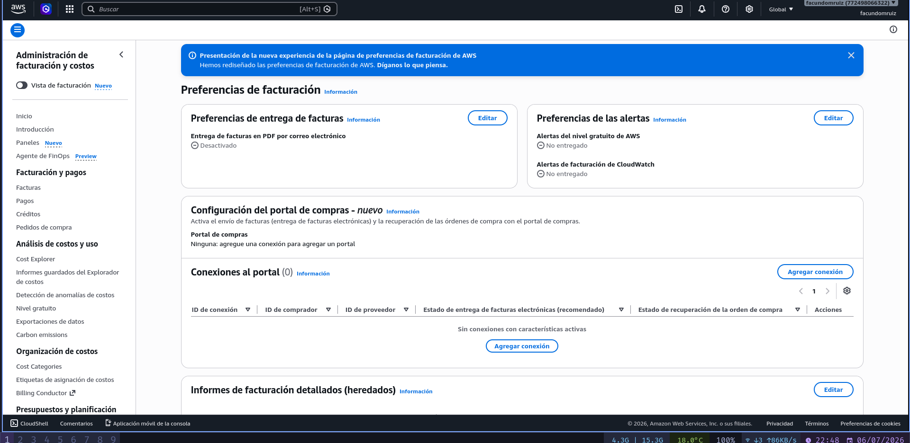
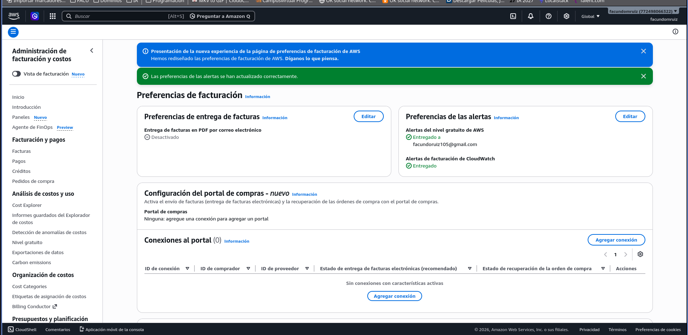
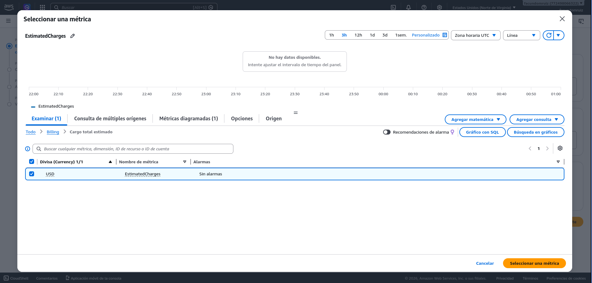
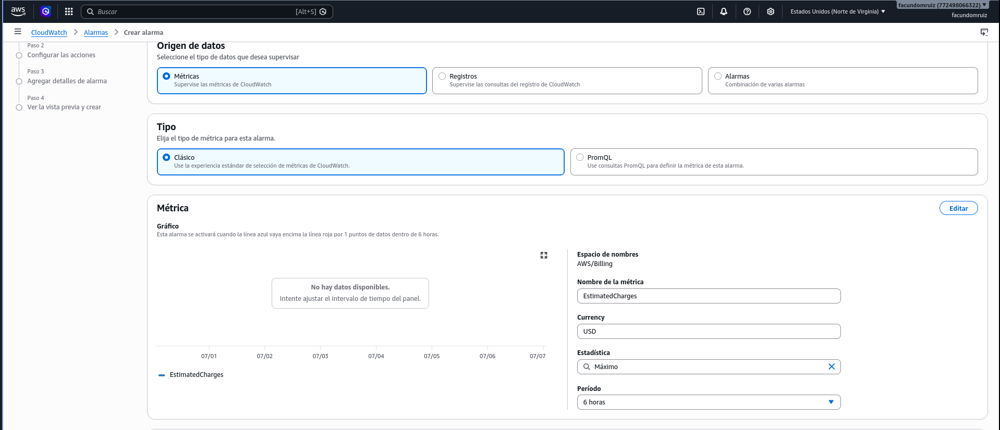
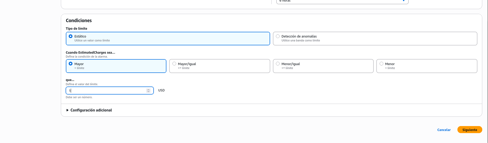
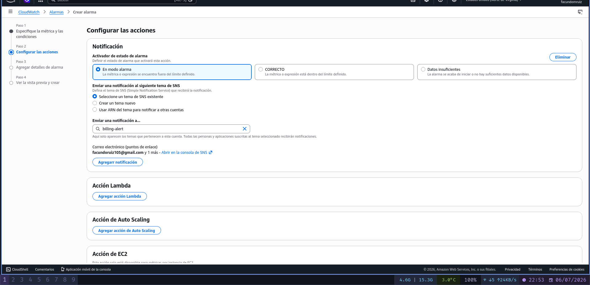
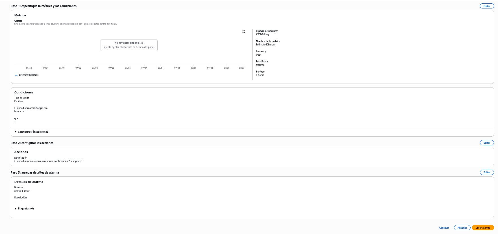

# 00 - Seguridad de la cuenta AWS real: Billing Alarm

Guía paso a paso (con capturas propias) para configurar una alarma que avisa por email si el gasto estimado en la cuenta supera $1 USD. **Hacer esto ANTES de tocar cualquier servicio en la cuenta real de AWS.**

## Por qué

AWS Free Tier es gratis dentro de ciertos límites, pero si te pasás (por error, por dejar algo prendido, etc.) te puede cobrar. Esta alarma es la red de seguridad: te avisa por mail apenas el gasto estimado supera $1, mucho antes de que sea un problema.

## Paso 1: Habilitar las alertas de facturación

Ir a **Billing and Cost Management → Billing Preferences** (URL directa: `https://us-east-1.console.aws.amazon.com/billing/home#/preferences`).

En la caja **"Preferencias de las alertas"**, click en **Editar** y activar **"Alertas de facturación de CloudWatch"**.

Después de guardar, debería verse así (ambas alertas "Entregado"):

> Nota: esta métrica puede tardar unas horas en aparecer disponible en CloudWatch la primera vez.

## Paso 2: Crear la alarma en CloudWatch

Ir a **CloudWatch**, cambiar la región (arriba a la derecha) a **US East (N. Virginia)** — las alarmas de billing solo existen ahí, sin importar en qué región trabajes después.

**Alarms → All alarms → Create alarm → Select metric → Billing → Total Estimated Charge**, marcar el checkbox de **EstimatedCharges (USD)**.

## Paso 3: Configurar la condición

Bajar hasta la sección **Condiciones**:

Configurar: **Tipo de límite = Estático**, **Mayor que**, valor **1** (USD).

## Paso 4: Configurar la notificación (SNS)

- Activador: **"En modo alarma"**
- **Crear un tema nuevo** de SNS (o reusar uno existente), ej: `billing-alert`
- Agregar el email donde querés recibir el aviso

**Importante**: después de crear el tema, llega un mail de **AWS Notifications** con un link de **"Confirm subscription"**. Si no se confirma, la alarma nunca va a avisar aunque esté bien configurada.

## Paso 5: Nombre y revisión final

Ponerle un nombre a la alarma (ej: `alerta-1-dolar`) y revisar el resumen antes de crear:

Click en **Crear alarma**.

## Resultado

Si el gasto estimado de la cuenta supera $1 USD, llega un email de aviso. Con esto ya se puede practicar en la cuenta real de AWS (Free Tier) sin miedo a un gasto sorpresa.
