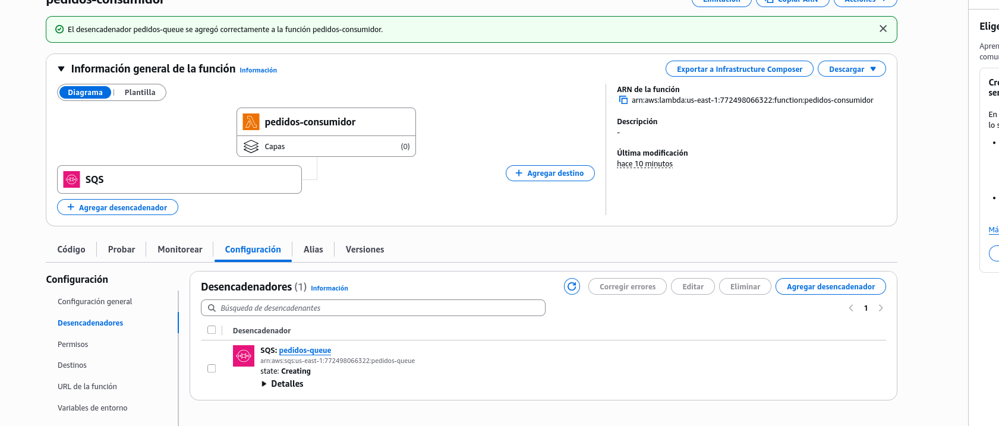
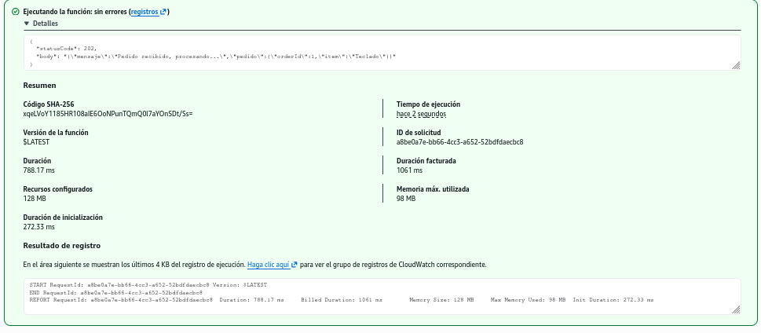
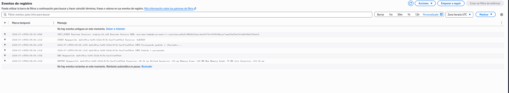
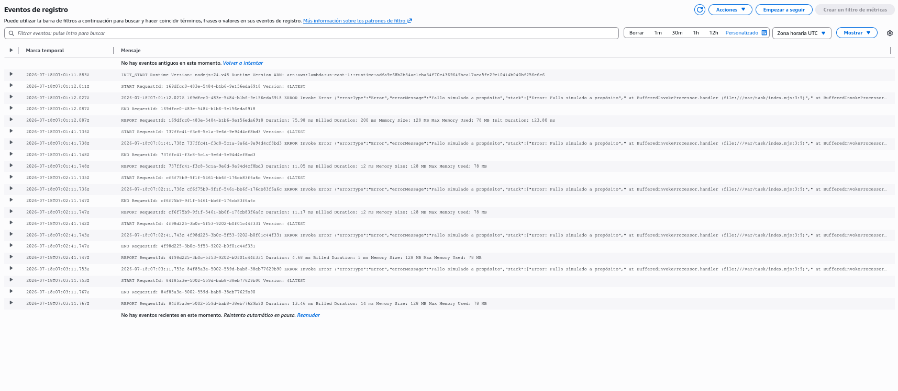
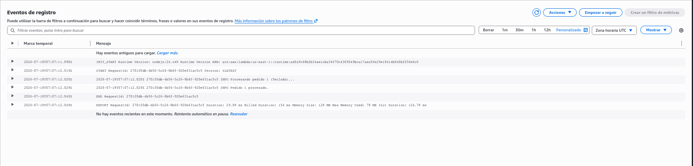

# 03 (AWS real) - Cola SQS real con productor y consumidor

## Objetivo

Crear una cola SQS de verdad, una Lambda que le manda mensajes (productor) y otra que se dispara sola cuando llegan mensajes (consumidor) — y comprobar en carne propia que un mensaje no se pierde aunque el consumidor falle. 100% Free Tier.

## Código

- `productor.js` / `consumidor.js`: versión CommonJS (`require`/`exports.handler`), la que se usaría si se despliega con Terraform (como en `proyectos/`)
- `productor.mjs` / `consumidor.mjs`: versión ES Modules (`import`/`export`), la que **realmente se usó** al pegar el código directo en la consola de Lambda — el runtime Node.js 20.x de la consola crea el archivo como `index.mjs` por defecto, y con eso `require` no existe (tira `ReferenceError: require is not defined in ES module scope`)

## Paso 1: Crear la cola SQS

1. Consola de AWS → **SQS** → **Create queue**
2. Tipo: **Standard**
3. Nombre: `pedidos-queue`
4. **Create queue**
5. Copiar la **URL de la cola** (se usa en el Paso 3)

## Paso 2: Crear la Lambda consumidora

1. Lambda → **Create function** → Author from scratch
2. Nombre: `pedidos-consumidor`, Runtime: **Node.js 20.x** → **Create function**
3. Pegar el contenido de `consumidor.mjs` en el editor (el archivo se llama `index.mjs` en la consola) → **Deploy**

### Dar permiso para leer la cola

4. Configuration → Permissions → click en el nombre del rol de ejecución (abre IAM)
5. Add permissions → Attach policies → buscar `AWSLambdaSQSQueueExecutionRole` → marcar el **checkbox** (no el nombre, eso abre el detalle) → Add permissions

### Conectar la cola como trigger

6. Volver a la Lambda → Configuration → Triggers → Add trigger
7. Seleccionar **SQS** → elegir `pedidos-queue` → Add



## Paso 3: Crear la Lambda productora

1. Lambda → Create function → `pedidos-productor`, Node.js 20.x
2. Pegar el contenido de `productor.mjs` → Deploy
3. Configuration → Environment variables → agregar `QUEUE_URL` = la URL de la cola del Paso 1
4. Configuration → Permissions → rol de ejecución → Attach policies → `AmazonSQSFullAccess`

## Paso 4: Probar de punta a punta

Test event en `pedidos-productor`:
```json
{ "orderId": 1, "item": "Teclado" }
```

Responde `202` de inmediato:



Sin invocar nada manualmente, el consumidor se dispara solo (CloudWatch Logs de `pedidos-consumidor`):



## Paso 5: El experimento — comprobar que el mensaje no se pierde

Se modificó `consumidor.mjs` a propósito para que falle:
```js
export const handler = async (event) => {
  throw new Error("Fallo simulado a propósito");
};
```

Se volvió a mandar un pedido desde `pedidos-productor`. Resultado en los logs: SQS reintentó el mensaje **5 veces**, cada ~30 segundos, todas fallando con el mismo error — el mensaje nunca se dio por perdido:



Se restauró el código original de `consumidor.mjs` y se hizo Deploy de nuevo. En el siguiente reintento automático, el mensaje se procesó bien:



**Conclusión del experimento**: el consumidor falló 5 veces seguidas y en ningún momento se perdió el mensaje — apenas se corrigió el código, SQS lo volvió a entregar y se procesó con éxito. Esta es la prueba concreta de la resiliencia que da una cola frente a fallos del consumidor.

## Limpiar

- Lambda → borrar `pedidos-productor` y `pedidos-consumidor`
- SQS → borrar `pedidos-queue`

## Documentación oficial

- [Usar Lambda con Amazon SQS](https://docs.aws.amazon.com/lambda/latest/dg/with-sqs.html)
- [SQS: visibility timeout (por qué se reintentan los mensajes)](https://docs.aws.amazon.com/AWSSimpleQueueService/latest/SQSDeveloperGuide/sqs-visibility-timeout.html)
- [Política administrada AWSLambdaSQSQueueExecutionRole](https://docs.aws.amazon.com/aws-managed-policy/latest/reference/AWSLambdaSQSQueueExecutionRole.html)
