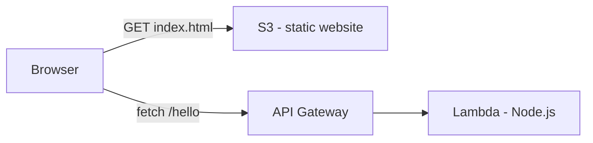
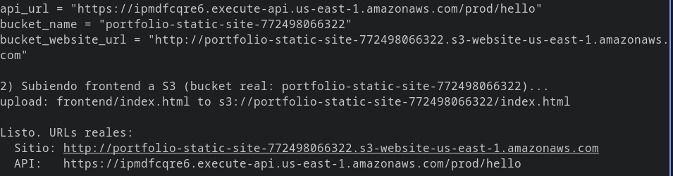
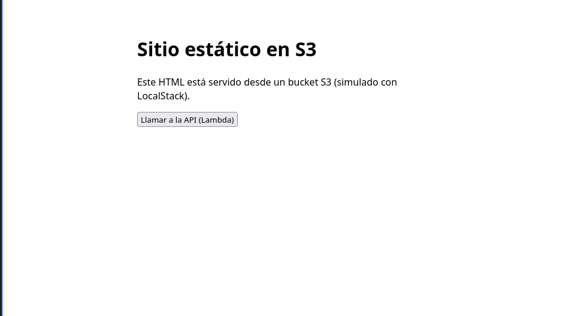
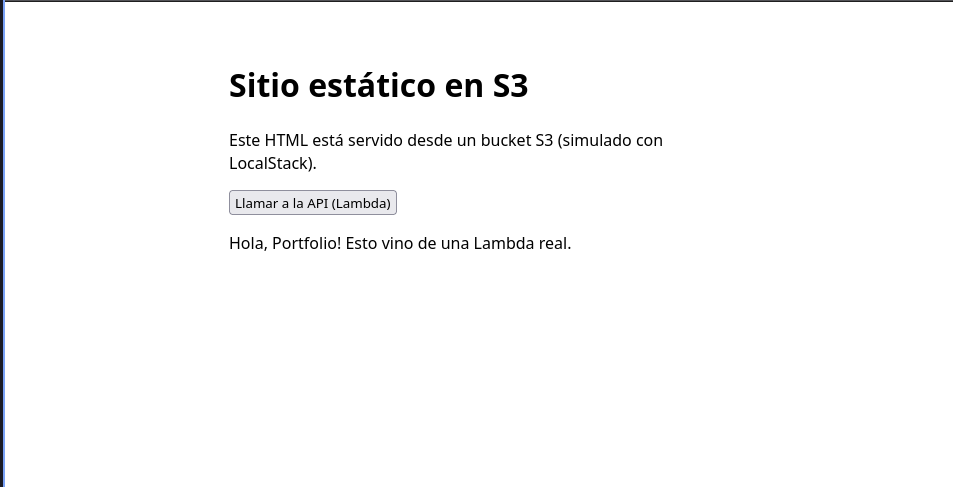
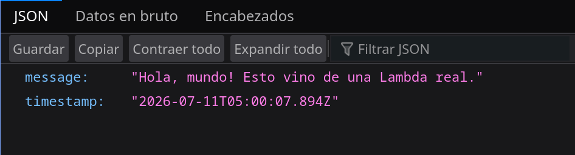

# 01 - Sitio estático (S3) + API serverless (Lambda + API Gateway)

Frontend estático servido desde S3 que llama a una API hecha con Lambda (Node.js) vía API Gateway. Todo corre local con LocalStack, sin cuenta AWS real.

## Arquitectura



## Stack

- LocalStack (S3, Lambda, API Gateway, IAM)
- Terraform + tflocal
- Node.js 20 (handler de la Lambda)
- Docker Compose

## Requisitos

- Docker
- Terraform
- AWS CLI real + `tflocal`/`awslocal` (wrappers)
- Cuenta gratuita de LocalStack + Auth Token

## Instalación

```bash
# Terraform (Ubuntu/Debian)
sudo apt update
sudo apt install -y gnupg software-properties-common
wget -O- https://apt.releases.hashicorp.com/gpg | gpg --dearmor | sudo tee /usr/share/keyrings/hashicorp-archive-keyring.gpg > /dev/null
echo "deb [signed-by=/usr/share/keyrings/hashicorp-archive-keyring.gpg] https://apt.releases.hashicorp.com $(lsb_release -cs) main" | sudo tee /etc/apt/sources.list.d/hashicorp.list
sudo apt update && sudo apt install -y terraform

# pipx (para instalar los CLIs de Python sin romper el sistema)
sudo apt install pipx -y
pipx ensurepath

# AWS CLI real + wrappers de LocalStack
pipx install awscli
pipx install awscli-local
pipx install terraform-local

# cerrá y volvé a abrir la terminal, después verificá:
terraform --version
aws --version
awslocal --version
tflocal --version
```

**Auth Token de LocalStack** (obligatorio desde 2026, incluso para uso gratuito):
1. Cuenta gratis en https://app.localstack.cloud (plan **Hobby**, no Trial — el Hobby es gratis para siempre en proyectos no comerciales)
2. Copiá tu token de la sección **Auth Tokens**
3. `cp .env.example .env` y pegá el token ahí (no se sube a git)

## Cómo correrlo

```bash
./deploy.sh
```

Levanta LocalStack, aplica el Terraform (bucket, Lambda, API Gateway) y sube el `index.html`. Al final imprime la URL del sitio y de la API.

Copiá la URL de la API y pegala en `frontend/index.html` (variable `API_URL`), después volvé a subir el archivo:

```bash
awslocal s3 cp frontend/index.html s3://portfolio-static-site/index.html
```

Abrí en el navegador la URL del sitio y probá el botón.

## Troubleshooting

Problemas reales encontrados corriendo esto en Debian/Ubuntu, en orden de aparición:

| Error | Causa | Solución |
|---|---|---|
| `error: externally-managed-environment` al hacer `pip install` | Debian/Ubuntu moderno bloquea `pip` a nivel de sistema (PEP 668) | Usar `pipx install <paquete>` en vez de `pip install` |
| Container se levanta y se cierra solo: `License activation failed` | Desde 2026 LocalStack exige cuenta + Auth Token incluso para uso gratuito | Crear cuenta free (**plan Hobby**, no Trial) en app.localstack.cloud, poner el token en `.env` |
| `tflocal`: `Unable to determine version: [Errno 2] No such file or directory: 'terraform'` | Terraform no estaba instalado (tflocal es solo un wrapper) | Instalar Terraform real (ver arriba) |
| `awslocal`: `No such file or directory: '.../.spicetify/aws'` | Bash cacheó una ruta vieja de `aws` (de una instalación previa/otra herramienta) que ya no existe | `hash -r` para limpiar el caché de comandos de la sesión, y si `aws` no existe todavía, `pipx install awscli` |

## 🌎 Desplegar en AWS real (no LocalStack)

Ya no es simulado — esto crea recursos de verdad en tu cuenta de AWS (dentro del Free account plan, sin costo).

### Requisitos

- Usuario IAM creado (ej: `dev-terraform`) con política `AdministratorAccess`
- AWS CLI configurado con sus credenciales: `aws configure` (ver `../../conceptos/00b-usuario-iam-despliegues/README.md` para el paso a paso completo)
- Verificar que apunta a la cuenta correcta: `aws sts get-caller-identity`

### Diferencias con la versión LocalStack

| | LocalStack (`terraform/`) | AWS real (`terraform-aws-real/`) |
|---|---|---|
| Provider | Con `endpoints {}` apuntando a `localhost:4566` | Provider AWS estándar, usa las credenciales de `aws configure` |
| Nombre del bucket S3 | Fijo (`portfolio-static-site`) | Con el account id agregado (los nombres de bucket son únicos en TODO AWS, no solo en tu cuenta) |
| Rol IAM de la Lambda | Sin política de logs (LocalStack no la exige) | Con `AWSLambdaBasicExecutionRole` adjunta (sin esto, en AWS real la Lambda no puede escribir en CloudWatch Logs) |
| Comandos | `tflocal`, `awslocal` | `terraform`, `aws` (los reales, sin wrapper) |

### Cómo correrlo

```bash
./deploy-aws-real.sh
```

Aplica el Terraform contra la cuenta real y sube el frontend. Al final imprime las URLs reales (no `localhost`).

Como siempre, copiar la URL de la API en `frontend/index.html` y volver a subir:

```bash
aws s3 cp frontend/index.html s3://<nombre-del-bucket-que-imprimió-el-script>/index.html
```

### Ver los logs reales

CloudWatch → Log groups → buscar `/aws/lambda/hello-function-real`. Ahí se ven las invocaciones reales, con duración y memoria usada — la misma vista que se usaría para debuggear en un trabajo real.

### Limpiar (no dejar nada corriendo en la cuenta real sin usar)

```bash
cd terraform-aws-real
terraform destroy -auto-approve
```

### Evidencia del deploy real (capturas propias)

**1. Salida de `terraform apply` — 14 recursos creados, URLs reales de AWS (no `localhost`):**



**2. Sitio cargando desde la URL real de S3 (`s3-website-us-east-1.amazonaws.com`), antes de invocar la API:**



**3. Después de tocar "Llamar a la API (Lambda)", respuesta real de la Lambda en la cuenta de AWS:**



**4. Respuesta JSON cruda de la API (vista de red del navegador), confirmando que viene de la Lambda real:**



> Nota: el texto del `index.html` todavía dice "simulado con LocalStack" porque es el mismo archivo reusado de la versión local — es solo un detalle de copy, no afecta el funcionamiento. Se puede actualizar el texto del frontend si se quiere prolijidad total.


## Decisiones de arquitectura (para la entrevista)

- **AWS_PROXY integration** en API Gateway: la Lambda recibe el request completo y devuelve la respuesta completa (statusCode, headers, body) — patrón estándar para APIs serverless en Node.
- **CORS manejado en el handler** (`Access-Control-Allow-Origin`), no en API Gateway, para centralizar el comportamiento HTTP en el código.
- **IAM role dedicado** para la Lambda con el mínimo necesario — principio de menor privilegio.

## Limpiar todo

```bash
cd terraform && tflocal destroy -auto-approve
cd ..
docker compose down -v
```

## Documentación oficial

- [S3: alojamiento de sitios web estáticos](https://docs.aws.amazon.com/AmazonS3/latest/userguide/WebsiteHosting.html)
- [S3: políticas de bucket](https://docs.aws.amazon.com/AmazonS3/latest/userguide/bucket-policies.html)
- [API Gateway: integración proxy Lambda](https://docs.aws.amazon.com/apigateway/latest/developerguide/set-up-lambda-proxy-integrations.html)
