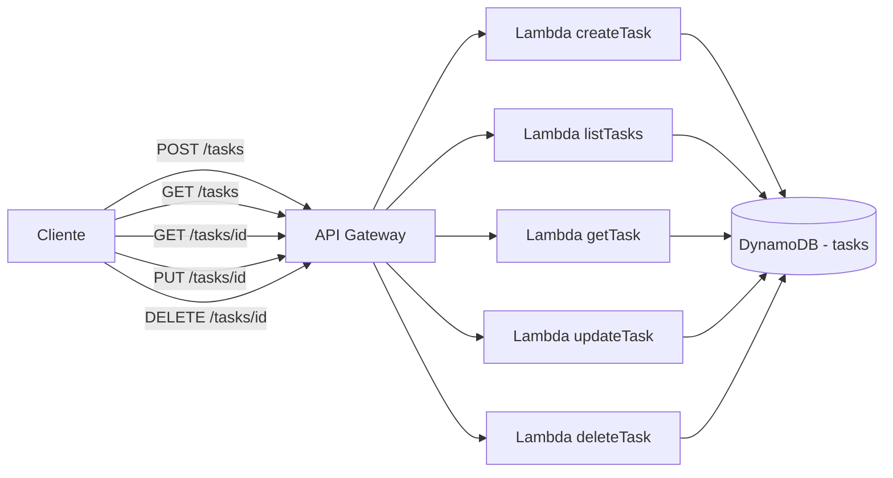

# 02 - CRUD API serverless (API Gateway + Lambda + DynamoDB)

API REST de gestión de tareas (to-do list) con las 4 operaciones CRUD completas, corriendo local con LocalStack.

## Arquitectura



## Stack

- LocalStack (DynamoDB, Lambda, API Gateway, IAM)
- Terraform + tflocal
- Node.js 20, AWS SDK v3
- Zod (validación de inputs)

## Rutas

| Método | Ruta | Lambda | Descripción |
|---|---|---|---|
| POST | `/tasks` | createTask | Crea una tarea |
| GET | `/tasks` | listTasks | Lista todas |
| GET | `/tasks/{id}` | getTask | Obtiene una |
| PUT | `/tasks/{id}` | updateTask | Actualiza (parcial) |
| DELETE | `/tasks/{id}` | deleteTask | Borra |

## Requisitos

Los mismos que el Proyecto 1 (Docker, Terraform, `tflocal`/`awslocal`, cuenta LocalStack + Auth Token), más:

```bash
sudo apt install -y zip nodejs npm
```

`.env` con tu `LOCALSTACK_AUTH_TOKEN` (copiá `.env.example`), igual que en el Proyecto 1.

## Cómo correrlo

```bash
./deploy.sh
```

Este script: instala dependencias de Node, levanta LocalStack, empaqueta las Lambdas en un zip, y aplica el Terraform. Al final imprime la URL base de la API.

## Probar las 5 rutas

```bash
API_URL="<la URL que te imprimió deploy.sh>"

# Crear
curl -X POST $API_URL -H "Content-Type: application/json" -d '{"title":"Aprender DynamoDB"}'

# Listar
curl $API_URL

# Obtener una (reemplazá <id> por el que te devolvió el POST)
curl $API_URL/<id>

# Actualizar
curl -X PUT $API_URL/<id> -H "Content-Type: application/json" -d '{"done":true}'

# Borrar
curl -X DELETE $API_URL/<id>
```

## Troubleshooting

Ver también el README del Proyecto 1 (mismos problemas de Auth Token / Terraform / PATH aplican acá). Específico de este proyecto:

| Error | Causa | Solución |
|---|---|---|
| `zip: command not found` al correr `deploy.sh` | Falta el comando `zip` | `sudo apt install zip -y` |
| Lambda tira error `Cannot find module 'zod'` (o similar) al invocar | El zip no incluyó `node_modules` (faltó correr `npm install` antes) | Correr `npm install --omit=dev` en la raíz del proyecto antes de `deploy.sh`, o simplemente re-correr `./deploy.sh` (ya lo hace solo) |
| `ResourceNotFoundException` al hacer GET/PUT/DELETE con un id | El id no existe en la tabla (probá copiar el id exacto que devolvió el POST) | Revisar el id, o correr `GET /tasks` para ver los ids existentes |

## Decisiones de arquitectura (para la entrevista)

- **Una Lambda por operación** (en vez de una sola Lambda con un switch por método/ruta): más alineado a cómo se estructuran APIs serverless reales, cada función escala y se despliega de forma independiente.
- **Zod para validación**: separa la validación de datos de la lógica de negocio, y da errores estructurados (`error.flatten()`) útiles para el cliente.
- **`PAY_PER_REQUEST` en DynamoDB**: no hay que provisionar capacidad, ideal para cargas variables o impredecibles (típico de una API nueva sin datos históricos de tráfico).
- **Chequeo de existencia antes de UPDATE/DELETE**: evita comportamientos ambiguos (por ejemplo, que un UPDATE sobre un id inexistente cree un ítem "fantasma" en vez de devolver 404).
- **Simplificación intencional**: el zip de la Lambda incluye `node_modules` completo sin bundlear con esbuild, para mantener el ejemplo simple. En un proyecto real conviene bundlear (esbuild/webpack) para reducir el tamaño del paquete y el cold start.

## Limpiar todo

```bash
cd terraform && tflocal destroy -auto-approve
cd ..
docker compose down -v
```
